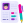

    
    
    

    

        
        
    

 
    Hey there! I'm Nguyen Anh Duc, aka Kudamii Nguyen, deeply passionate about Python, algorithms, and the mysteries that surround us. With Python, I craft solutions to intricate problems, while algorithms fascinate me with their blend of logic and creativity. Beyond coding, I'm endlessly curious about the unknown, always seeking to unravel its secrets. Join me on this journey of exploration and innovation! 🚀🔍

 
    

        
        
    

 

    
    

    

    

 
 

    

        
        
    

 
<table align="left">
    <thead align="left">
        <tr>
            <th>
                
            </th>
            <th>
                
            </th>
            <th>
                
            </th>
            <th>
                
            </th>
            <th>
                
            </th>
            <th>
                
            </th>
            <th>
                
            </th>
        </tr>
    </thead>
</table>

 
 
 

    
 MY CV 

     
     
    <a href="#" target="_blank" rel="noopener noreferrer"> 
        

            
            
        

    </a>
    
     
     
     
     
    <!-- Montasim's Photo -->
    
    
     
     
    
     
     
     
<!-- quick link start -->
    <pre>
    <b>Email     :</b> <a href="ducna1462@gmail.com" target="_blank" rel="noopener noreferrer">ducna1462@gmail.com</a> 
    <b>Portfolio :</b> <a href="#" target="_blank" rel="noopener noreferrer">----</a>
    <b>Mobile    :</b> <a href="+84765868665" target="_blank" rel="noopener noreferrer">+84765868665</a>
    <b>GitHub    :</b> <a href="https://github.com/dwxcod62" target="_blank" rel="noopener noreferrer">github.com/dwxcod62</a>
    </pre>
<!-- quick link end -->
     
     
    <!-- work experience start -->
    
    <table>
        <thead>
            <tr>
                <th>Company</th>
                <th>Position</th>
                <th>Field</th>
                <th>Duration</th>
            </tr>
        </thead>
        <tbody>
            <tr>
                <td>
                    <a href="https://github.com/dwxcod62/RoomMart" target="_blank" rel="noopener noreferrer"> Room Mart + </a>
                </td>
                <td>Software Engineer</td>
                <td>Fullstack Development</td>
                <td>Jan 2024 - Apr 2024</td>
            </tr>
        </tbody>
    </table>
    <!-- work experience end -->
     
    <!-- skills start -->
    
    <table>
        <thead>
            <tr>
                <th>Name</th>
                <th>Details</th>
            </tr>
        </thead>
        <tbody>
            <tr>
                <td>
                    <b>Frontend</b>
                </td>
                <td>
                    Next JS, Tailwind CSS, Bootstrap
                </td>
            </tr>
            <tr>
                <td>
                    <b>Backend</b>
                </td>
                <td>
                    Django, Flask, Go Lang
                </td>
            </tr>
            <tr>
                <td>
                    <b>DevOps</b>
                </td>
                <td>
                    Git, GitHub
                </td>
            </tr>
            <tr>
                <td>
                    <b>Tools</b>
                </td>
                <td>
                    Visual Studio Code, Visual Studio, Canva, Intelji
                </td>
            </tr>
            <tr>
                <td>
                    <b>Familiar With</b>
                </td>
                <td>
                    Python, Java, Html, JavaScript, Go
                </td>
            </tr>
        </tbody>
    </table>
    <!-- skills end -->
     
    <!-- Start Training, Participation and Certification -->
    
    <ol>
        <li>
            <a href="https://coursera.org/share/c80975f7c75d45401ae88f272994bf81" target="_blank" rel="noopener noreferrer">Software Development Lifecycle</a>
        </li>
        <li>
            <a href="https://coursera.org/share/e25048424bcf7b23bc10a4634879515f" target="_blank" rel="noopener noreferrer">CertNexus Certified Ethical Emerging Technologist</a>
        </li>
        <li>
            <a href="https://coursera.org/share/0c55cad5e59654a86327e96d017e72e7" target="_blank" rel="noopener noreferrer">Web Design for Everybody: Basics of Web Development & Coding</a>
        </li>
        <li>
            <a href="https://coursera.org/share/6f3441574d51628d75cb1b95f1b94e90" target="_blank" rel="noopener noreferrer">Computer Communications</a>
        </li>
        <li>
            <a href="https://coursera.org/share/81aae81bb0e606e5e5bd7aeb1119f372" target="_blank" rel="noopener noreferrer">Academic Skills for University Success</a>
        </li>
        <li>
            <a href="https://www.hackerrank.com/certificates/c9cec7cd691b" target="_blank" rel="noopener noreferrer">Python (Basic) Certificat`e</a>
        </li>
    </ol>
    <!-- End Training, Participation and Certification -->
     
    <!-- academic qualification start-> -->
    
    <table align="center">
        <thead>
            <tr>
                <th>
                    <b> Exam </b>
                </th>
                <th>
                    <b> Concentration / Major </b>
                </th>
                <th>
                    <b> Institute </b>
                </th>
                <th>
                    <b> Result </b>
                </th>
                <th>
                    <b> Passing Year </b>
                </th>
            </tr>
        </thead>
        <tbody>
            <tr>
                <td> - </td>
                <td> - </td>
                <td>
                    -
                </td>
                <td> - </td>
                <td> - </td>
            </tr>
        </tbody>
    </table>      
     
     
    <!-- Start Language Proficiency -->
    
    <table>
        <thead>
            <tr>
                <th><b> Language </b></th>
                <th><b> Reading </b></th>
                <th><b> Writing </b></th>
                <th><b> Speaking </b></th>
            </tr>
        </thead>
        <tbody>
            <tr>
                <td> English </td>
                <td> Medium </td>
                <td> Medium </td>
                <td> Medium </td>
            </tr>
            <tr>
                <td> Vietnamese </td>
                <td> High </td>
                <td> High </td>
                <td> High </td>
            </tr>
        </tbody>
    </table>
    <!-- End Language Proficiency -->
     
     
     

